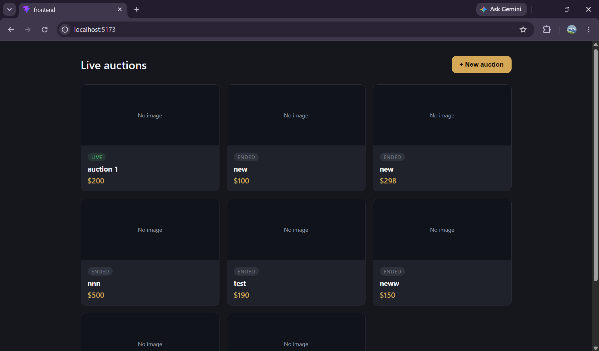
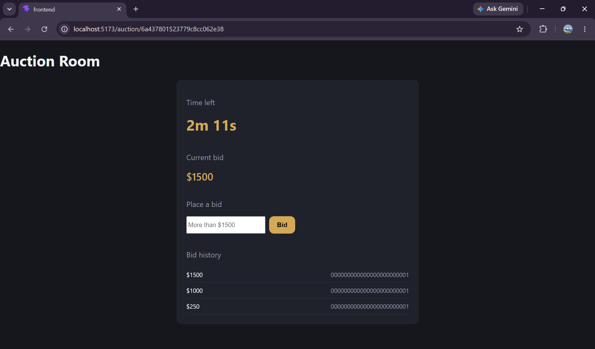
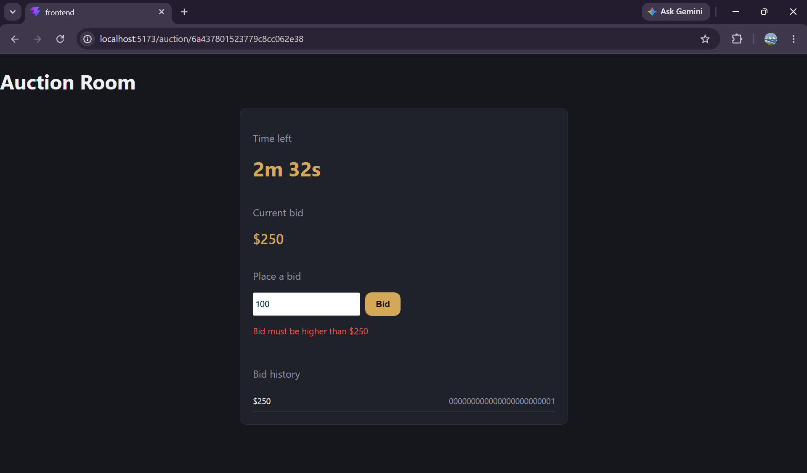
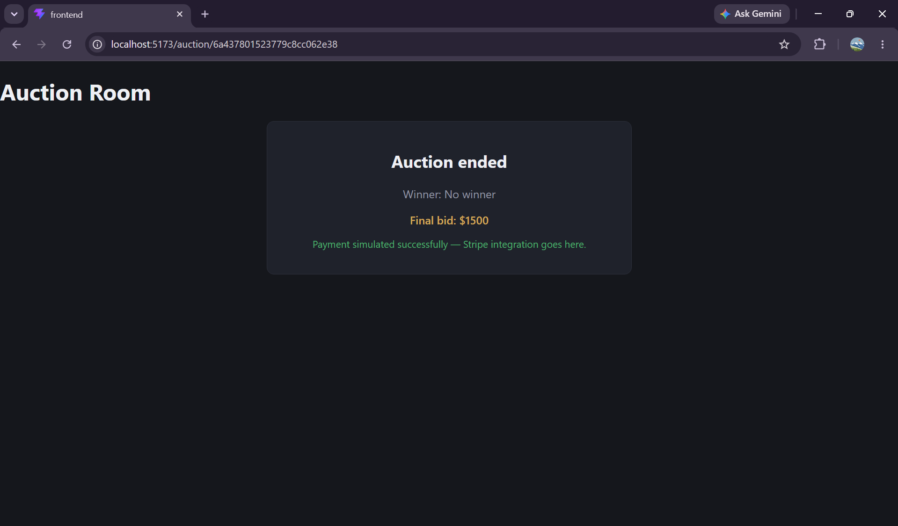

# Live Auction Platform

A real-time bidding app - sellers list items, buyers bid live, and the highest bidder wins automatically when the countdown hits zero. Built on the MERN stack with Socket.io powering live bid broadcasting across all connected clients.

## Why I built this

I started from a MERN chat app I'd already tried to understand and read and noticed that a Socket.io chat room and a live auction room solve the same underlying problem: a group of clients in a shared channel reacting to state changes in real time. I repurposed the room-join pattern and message model into bids, then replaced "message ordering" with the actually hard part: a server-authoritative countdown that has to survive a server restart without losing track of time. I used the endTime timestamo approach to solve and build a server-side clock that can't be wrong even if the server crashes.

## Features

- **Real-time bidding rooms** - each auction is its own Socket.io room (`socket.join(auctionId)`), so bid updates only broadcast to people actually watching that auction
- **Server-side bid validation** - every bid is checked against the current price and auction status before it touches the database, so a stale or low bid is rejected with a clear reason instead of silently failing
- **Crash-safe countdown timer** - the timer is recalculated from an absolute `endTime` timestamp stored in MongoDB, not an in-memory counter, so it self-corrects if the server restarts mid-auction
- **Live bidding indicator** - shows "X is typing a bid..." to other viewers in the room in real time
- **Auction creation flow** - sellers can list an item with a starting price, optional reserve, and end time directly from the UI
- **Status-aware auction grid** - home page shows live, scheduled, and ended auctions with distinct visual states

## Tech stack

**Backend:** Node.js, Express, MongoDB Atlas, Mongoose, Socket.io
**Frontend:** React (Vite), socket.io-client, axios, react-router-dom

## Architecture

```
Client                    Server                     MongoDB
  │                          │                           │
  ├─ join_auction ──────────►│                           │
  │                          ├─ socket.join(room) ───────┤
  │                          │                           │
  ├─ place_bid ──────────────►│                           │
  │                          ├─ validate (live, price)──►│
  │                          │◄── bid persisted ──────────┤
  │◄── auction_update ───────┤  (broadcast to room)      │
  │◄── bid_confirmed ────────┤                           │
  │                          │                           │
  │     [server restarts]    │                           │
  │                          ├─ restartTimers() ─────────►│
  │                          │◄── find live auctions ─────┤
  │                          ├─ recompute from endTime    │
  │◄── timer_tick (resumed)──┤                           │
```

Each auction's countdown runs as a `setInterval` + `setTimeout` pair held in an in-memory `Map`, keyed by auction ID. On server boot, `restartTimers()` queries MongoDB for any auction still marked `live`, recalculates the remaining time from its stored `endTime`, and either resumes the timer or closes the auction immediately if time already ran out while the server was down.

## Screenshots

**Home — live and ended auctions side by side**


**Live bidding room — timer, current bid, and bid history updating in real time**


**Server-side validation — a bid below the current price is rejected before it reaches the database**


**Auction ended — simulated payment flow**


## Setup

```bash
# Backend
cd backend
npm install
# add a .env with MONGO_URI=<your MongoDB Atlas connection string>
node server.js

# Frontend (new terminal)
cd frontend
npm install
npm run dev
```

Open `http://localhost:5173`, click **+ New auction** to create and start a live auction, then open a second tab to watch bids sync across clients in real time.

## Known limitations (intentional scope cuts)

- **No authentication** - bidder identity is currently a hardcoded placeholder ID, so the demo focuses entirely on the real-time bidding architecture rather than user management
- **Payment is simulated** - the "Pay Now" button shows a success state client-side as a placeholder for where a real Stripe payment intent flow would plug in
- **Single MongoDB index strategy** - works well at demo scale; a production version would add compound indexes on `status + endTime` for auction lookups at higher volume

## What I'd build next

- JWT-based auth so `bidder` and `seller` are real authenticated users instead of placeholders
- Stripe integration for the payment step
- Redis-backed timer state instead of an in-memory `Map`, so the app can run across multiple server instances instead of a single Node process